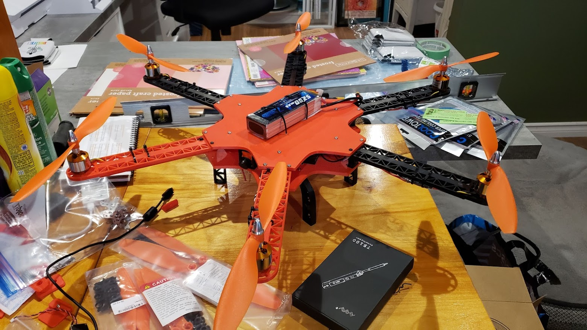

# Hexacopter
Hexacopter Camera Drone -- WIP

Overview

Parts List
- Flight Controller - Matek Systems F722-SE
- ESC - 6x FVT LITTLEBEE BLHeli-s SPRING 30A Brushless ESC
- Motors - 6x A2212 Brushless 1000KV
- PDB - Matek Systems FCHUB-6S
- FPV Cam - TS5828L 1500TVL
- Gimbal - https://www.thingiverse.com/thing:2538360
--- Controller - Storm32 BGC
--- Gimble Motors - 2x 2804 100kv
--- Gimble Motors - 1x 2206 100T
- GPS/Compass - Matek Systems M8Q-5883
- Range Finder (down) - Benewake TFLuna 0.2-8m 100Hz LiDAR
- FVP Monitor - 480x272 FPV monitor
- GoPro - GoPro Hero9

Printing
Printing was done entirely in ABS+ on my Voron V2.4 using default Voron settings. 

